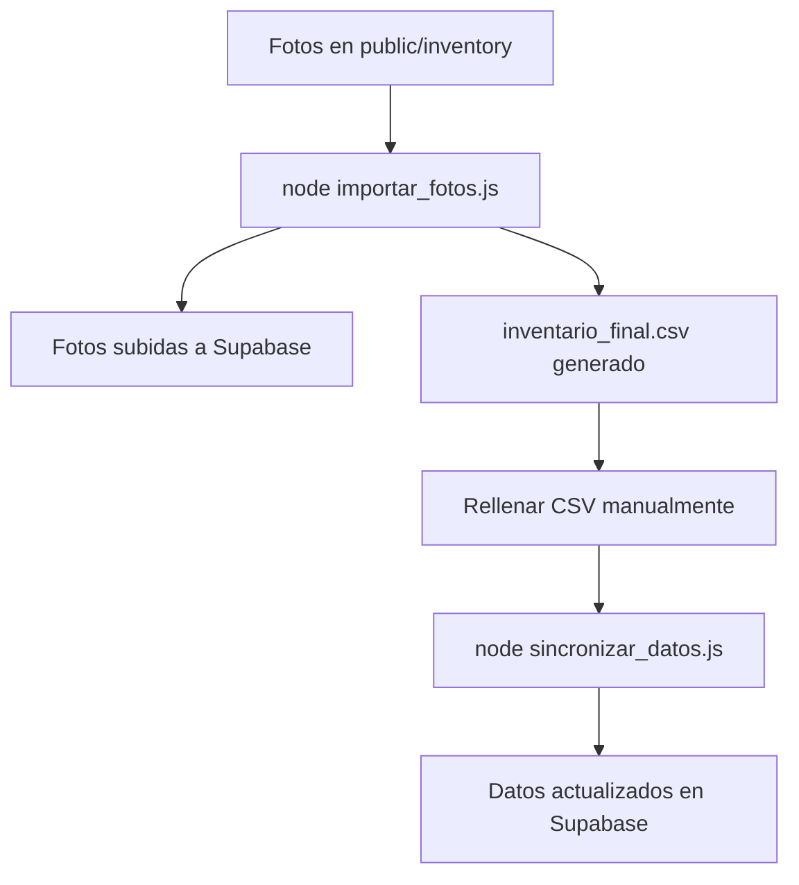

# 🚗 Scripts de Automatización de Inventario

Este proyecto incluye dos scripts de Node.js para automatizar la gestión del inventario de coches con Supabase.

## 📋 Requisitos Previos

Antes de ejecutar los scripts, asegúrate de:

1. ✅ Tener configurado tu proyecto de Supabase
2. ✅ Crear un bucket de Storage llamado `coches`
3. ✅ Crear la tabla `coches` en tu base de datos
4. ✅ Configurar las políticas de almacenamiento para permitir subidas
5. ✅ Tener las credenciales en `.env.local`:
   - `VITE_SUPABASE_URL`
   - `VITE_SUPABASE_ANON_KEY`

## 📦 Instalación

Las dependencias ya están instaladas, pero si es necesario reinstalarlas:

```bash
npm install csv-parser csv-writer dotenv
```

## 🔧 Uso

### Script 1: `importar_fotos.js`

Este script sube las fotos a Supabase y genera un CSV para rellenar manualmente.

**Pasos:**

1. Coloca todas tus fotos en la carpeta `public/inventory`
2. Asegúrate de que los nombres de archivo contengan la matrícula del coche
   - Ejemplos válidos: `1234ABC.jpg`, `ABC1234.png`, `1234-ABC_frontal.jpg`
3. Ejecuta el script:

```bash
node importar_fotos.js
```

**Qué hace:**
- Lee todas las imágenes de `public/inventory`
- Extrae la matrícula del nombre de archivo
- Sube cada imagen al bucket `coches` en Supabase
- Crea un registro en la tabla `coches` con la matrícula
- Genera `inventario_final.csv` en la raíz del proyecto

**El CSV generado tiene estas columnas:**
- MATRICULA (rellenado automáticamente)
- MARCA (vacío - rellenar manualmente)
- MODELO (vacío - rellenar manualmente)
- AÑO (vacío - rellenar manualmente)
- PRECIO (vacío - rellenar manualmente)
- KM (vacío - rellenar manualmente)
- MOTOR (vacío - rellenar manualmente)
- CV (vacío - rellenar manualmente)
- COMBUSTIBLE (vacío - rellenar manualmente)
- ETIQUETA (vacío - rellenar manualmente)

---

### Script 2: `sincronizar_datos.js`

Este script lee el CSV rellenado y actualiza los datos en Supabase.

**Pasos:**

1. Abre `inventario_final.csv` (generado por el script anterior)
2. Rellena manualmente los datos de cada coche:
   - MARCA: ej. "Volkswagen"
   - MODELO: ej. "Golf GTI"
   - AÑO: ej. "2020"
   - PRECIO: ej. "18500" (sin símbolo de euro)
   - KM: ej. "45000"
   - MOTOR: ej. "2.0 TSI"
   - CV: ej. "245"
   - COMBUSTIBLE: ej. "Gasolina"
   - ETIQUETA: ej. "C"
3. Guarda el archivo CSV
4. Ejecuta el script:

```bash
node sincronizar_datos.js
```

**Qué hace:**
- Lee `inventario_final.csv`
- Para cada registro, actualiza la fila correspondiente en Supabase usando la matrícula
- Convierte automáticamente los tipos de datos (números para AÑO, PRECIO, KM, CV)
- Muestra un resumen de registros actualizados, saltados y errores

## 🎯 Flujo Completo



## ⚠️ Notas Importantes

1. **Nombres de archivo**: Asegúrate de que los nombres de las fotos contengan la matrícula del coche
2. **Formato CSV**: No cambies los nombres de las columnas del CSV
3. **Tipos de datos**: 
   - AÑO, KM, CV deben ser números enteros
   - PRECIO puede tener decimales
   - Los demás campos son texto
4. **Matrícula única**: La matrícula se usa como clave única. Si subes la misma foto dos veces, se sobrescribirá

## 🐛 Solución de Problemas

### Error: "El directorio public/inventory no existe"
- Crea la carpeta `public/inventory` manualmente
- Coloca tus fotos allí

### Error: "VITE_SUPABASE_URL y VITE_SUPABASE_ANON_KEY deben estar definidos"
- Verifica que `.env.local` existe
- Verifica que contiene las variables correctas

### Error al subir fotos
- Verifica que el bucket `coches` existe en Supabase
- Verifica las políticas de almacenamiento (deben permitir INSERT y UPDATE)

### Error al actualizar datos
- Verifica que la tabla `coches` existe
- Verifica que tiene las columnas correctas
- Asegúrate de haber ejecutado primero `importar_fotos.js`
